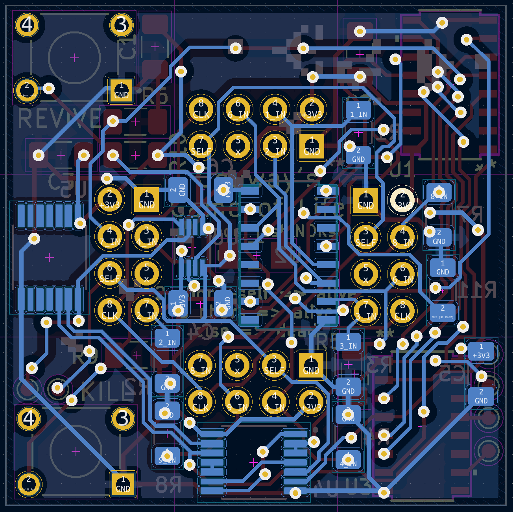
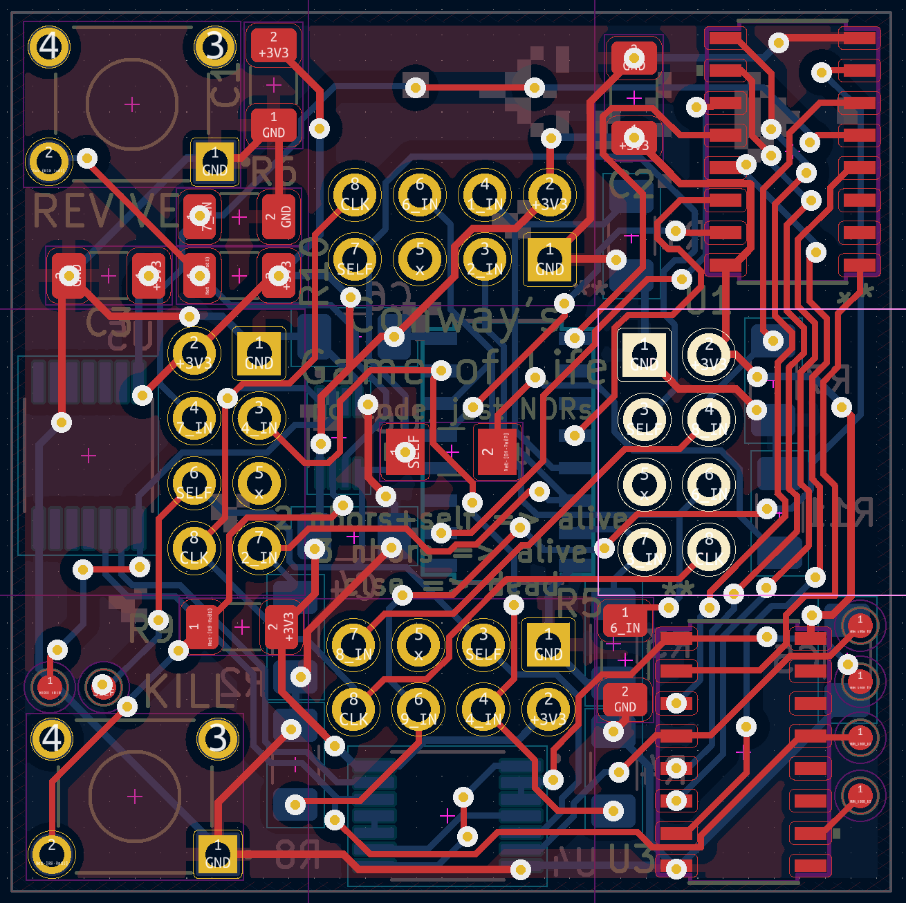

# Conway's Game of Life (entirely in hardware)

> NOTE:
>
> This is a KiCAD project, don't expect GitHub to play especially well with it.

|   Back Copper Layer    |    Front Copper Layer    |
| :--------------------: | :----------------------: |
|  |  |

This project implements Conway's game of life, entirely in hardware. Many
existing attempts to do this fail (IMO) in one of several ways. The features of
this project are:

- All logic is computed via logic gates, no microcontrollers are used
- Each cell in the game of life is an independent PCB, and cells can be
  disconnected/connected at will

I am still busy optimising the design, but I have ordered and tested PCBs from
JLCPCB, the design and concept works.

# What is Conway's Game of Life?

It is a "one-player" game which takes place on an infinite grid of square
cells. Each cell can be alive or dead, and they live/die according to how many
of their neighbours are alive or dead:

- three neighbours? I'll become alive
- two neighbours and I'm alive? I'll remain alive
- otherwise, I'll die

This simple set of rules can lead to complex behaviour, such as "gliders" which
move across the world, and "glider guns" which produce such gliders:

There is a large taxonomy of creatures in CGoL, the [wiki][1] is very helpful.

# What does this project do?

todo

[1]: https://conwaylife.com/wiki/Main_Page
