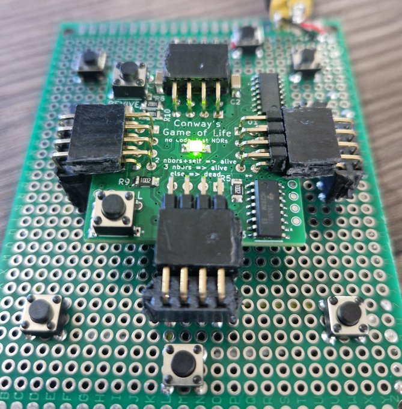

# Conway's Game of Life (entirely in hardware)

> NOTE:
>
> This is a KiCAD project, don't expect GitHub to play especially well with it.

|   Back Copper Layer    |    Front Copper Layer    |
| :--------------------: | :----------------------: |
|  |  |

This project implements Conway's game of life, entirely in hardware. Many
existing attempts to do this fail (IMO) in one of several ways. The features of
this project are:

- All logic is computed via logic gates, no microcontrollers are used
- Each cell in the game of life is an independent PCB, and cells can be
  disconnected/connected at will

I am still busy optimising the design, but I have ordered and tested PCBs from
JLCPCB, the design and concept works.

|      Input/Output Headers      |
| :----------------------------: |
|              |
|       Sum-of-neighbours        |
|  |
|   Logic (should I be dead?)    |
|        |

# What is Conway's Game of Life?

(expand if you don't know what CGoL is)

It is a cellular automaton on an infinite grid of square cells. Each cell is
either alive or dead. All cells update **simultaneously** in discrete ticks
based only on their eight adjacent neighbours (N, NE, E, SE, S, SW, W, NW). It
is usually called a **zero-player** game: you choose the starting pattern; the
rules determine everything after.

Rules per tick:

- exactly three live neighbours => the cell is alive next tick (birth or survival)
- exactly two live neighbours **and** the cell is currently alive => it stays alive
- any other neighbours count => the cell is dead next tick

This small rule set yields rich behaviour:

- Still lifes: patterns that do not change (e.g., block, beehive)
- Oscillators: patterns that repeat after N ticks (e.g., blinker, toad)
- Spaceships: patterns that translate over the grid (e.g., glider)
- Guns: patterns that periodically emit spaceships (e.g., Gosper glider gun)

Example of motion and emission:

There is a large taxonomy of creatures in CGoL, the [wiki][1] is comprehensive.

# What is this project?

This project is a circuit board that implements Conway's game of life in pure
hardware using digital logic circuits. There is no Arduino, no code, no
microcontrollers, no "flashing". Just NOR gates. Each cell in Game of Life is a
completely independent PCB, and only has knowledge of it's eight immediate
neighbours. Physically connecting a grid of PCBs together will give you a
network of cells, and then you can run Game of Life.

|  Render of the front of the PCB   |  Render of the back of the PCB  |
| :-------------------------------: | :-----------------------------: |
|  |  |

As far as I can tell, nobody's done this before. There's been hardware
implementations of Life, but they all use microcontrollers and typically just
have one small grid that can't be extended (which seems lame IMO).

Each cell is about 35mm on a side and has an LED in the middle to indicate if
the cell is alive or dead. There's also two buttons: KILL and REVIVE that'll
force the state of the cell, so that you can initialise the game.

|    Two cells connected together     | Render of many cells connected together |
| :---------------------------------: | :-------------------------------------: |
|  |   |

I'm quite proud of this little thing. It's the first PCB I've designed and
overall it went really well. There were several fun engineering challenges with
routing information between cells and minimising the Game of Life logic to be
suitable for expression via NOR gates. My background is in the ideal perfect
world of computer science, and it has been very interesting learning PCB design
and making something that works in the real world against real constraints. I
strongly recommend anyone curious about it to give PCB design a go.

| It works! (cell in a testing jig, in the "alive" state) |
| :-----------------------------------------------------: |
|                     |

# Challenges/details

(I'm still writing this up and adding to this as I encounter new challenges)

## Routing information between cells

Each cell needs to know the state (alive/dead) of the eight cells surrounding
it. The four directly adjacent cells are easy, we can just have a pin & socket
poking out of the four edges of the boards. But the four diagonal cells are
trickier, because if we had diagonal pins & sockets then we wouldn't be able to
plug anything in.

The solution here is quite neat: you can route the information for diagonal
cells _through_ the directly adjacent cells. For example, to get state from the
top-left cell to the central cell, the state for the top-left cell will go
first to the left cell, and then to the central cell.

| Cell State is communicated via adjacent neighbours |
| :------------------------------------------------: |
|                                  |

## Implementing Game of Life via NOR circuits

(WIP)

## Calculating the neighbours sum

(WIP)

## Problems & frustrations

[you-live-like-this.meme]

Some notes from a software dev about pains in the electronic engineering world
that absolutely don't need to be there. It's kinda insane to me that some of
these problems still exist and don't have _any_ prospective solutions.

- PCB circuit "linting" basically doesn't exist, and could be a lot better.
- importing footprints is incredibly tedious and manual, not at all like `cargo
add random`.
- Insane that circuit manufacturers almost certainly have computer-readable
  descriptions of the behaviour of their chips but don't make that generally
  available. If you want to run "unit tests" on your circuit, you basically
  have to mock/re-define the behaviour of every chip you use. Which is a mammoth
  task if starting from scratch.
- The datasheet is the medium for communicating information about electrical
  components, but _there's no computer-readable format_. So you end up having
  to also find some footprints and schematics for the component (this
  information is in the datasheet, but computer's can't parse the
  images/diagrams).
- KiCAD is (mostly) a very capable piece of software. It could be better, but
  all my problems are "wants" rather than "needs", and I never explored the
  ecosystem of plugins that I believe dramatically improve the base experience.

To be clear: lots of these problems are "small" or "once-off" or solvable by
"just know this hack". But the whole culture in electronic engineering seems to
be to ignore the paper-cuts, while the culture amongst software engineers is
overwhelmingly the opposite. Software engineers are probably more guilty of
spending too _much_ time trying to automate every little inconvenience and
remove all manual steps from their once-a-year workflow. But the result of this
obsession is that most things are _able_ to be automated, and there's a
proliferation of adhered-to standards. Critically, being able to automate
things requires well-defined interfaces between different companies &
organisations across different countries. We tend to take this for granted in
software, especially amongst open-source. But electrical engineers remark that
certain automation steps are impossible because it requires coordination across
different suppliers on standards for representing information about components.
This is 100% a solved problem in software, and I'd never before realised what a
powerhouse the humble RFC is. The lack of a computer-readable datasheet for
electrical components is _insane_ to me, and ripe for automation via LLMs (if
not today, then in 5 years time).

# Next steps

Thanks to the Albert, Karel, Dirk S., Armand, and the other devs at CubeSpace
for advice, and various anime-profile-picture twitter accounts in the PCB Book
Club for schematic/PCB reviews)

[1]: https://conwaylife.com/wiki/Main_Page
